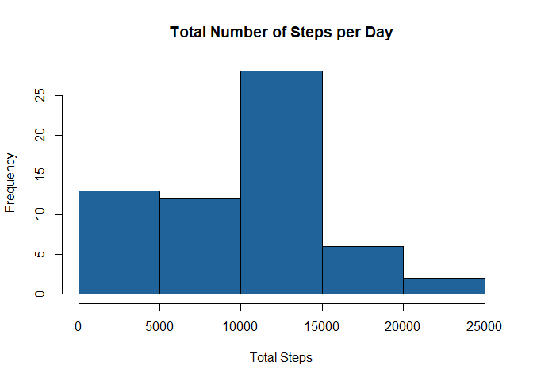
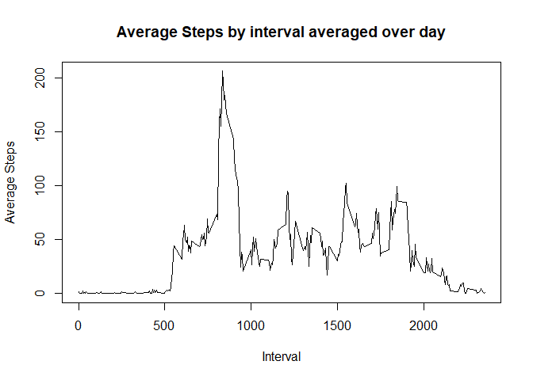
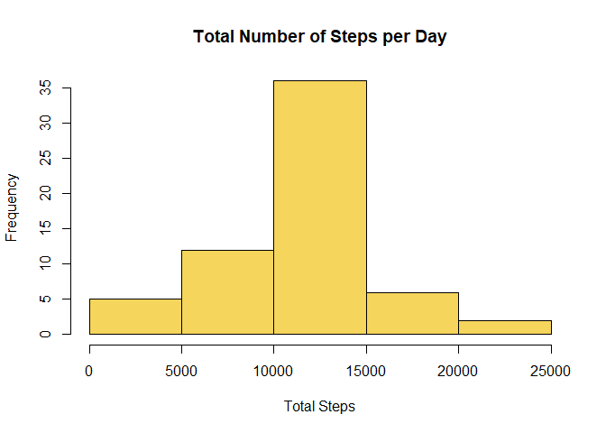
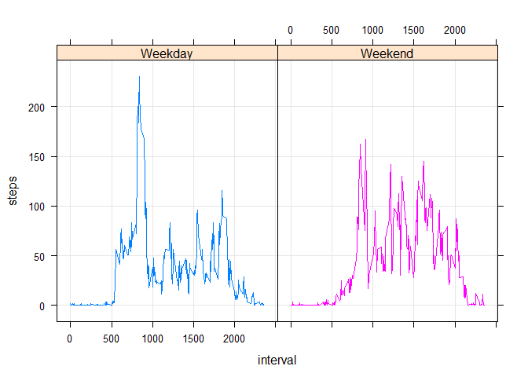

Downloading and preprocessing the data
--------------------------------------

    download.file(url = "https://d396qusza40orc.cloudfront.net/repdata%2Fdata%2Factivity.zip",destfile = "./data.zip",method = "curl")

    unzip("data.zip")

    activity <- read.csv(file = "activity.csv",header = T,stringsAsFactors = F)

What is mean total number of steps taken per day?
-------------------------------------------------

-   Histogram of the total number of steps taken each day

<!-- -->

    steps_day<-aggregate(activity$steps, by = list(activity$date), FUN = sum, na.rm = TRUE)
    colnames(steps_day) <- c("date","steps")

    hist(steps_day$steps,col = "#20639B",xlab = "Total Steps",ylab = "Frequency",main = "Total Number of Steps per Day")

-   Mean and median number of steps taken each day

<!-- -->

    mean(steps_day$steps)

    ## [1] 9354.23

    median(steps_day$steps)

    ## [1] 10395

What is the average daily activity pattern?
-------------------------------------------

-   Time series plot of the interval and the average number of steps
    taken, averaged across all days

<!-- -->

    steps_daily<-aggregate(activity$steps, by = list(activity$interval), FUN = mean, na.rm = TRUE)
    colnames(steps_daily) <- c("interval","steps")

    plot(steps_daily$interval,steps_daily$steps,type = "l",xlab = "Interval",ylab = "Average Steps",main = "Average Steps by interval averaged over day")

-   The 5-minute interval which contains the maximum number of steps is:

<!-- -->

    match(max(steps_daily$steps),steps_daily$steps)

    ## [1] 104

    steps_daily[104,1]

    ## [1] 835

The 5-minute interval that contains the maximum number of steps is 835.

Imputing missing values
-----------------------

-   The total number of missing values in the dataset:

<!-- -->

      sum(is.na(activity$steps))

    ## [1] 2304

-   Strategy for filling in all of the missing values in the dataset:
    All the NA values have been filled by using the average(Which has
    been calculated in "steps\_daily") values of steps corresponding to
    that interval.

<!-- -->

    index_NA <- which(activity$steps %in% NA)
    for (i in 1:sum(is.na(activity$steps))) 
      {
      activity$steps[index_NA[i]]<-steps_daily[steps_daily==activity$interval[index_NA[i]],2]
    }

    #Check for NA values
    sum(is.na(activity$steps))

    ## [1] 0

    #Creating new variable
    steps_day_new <- aggregate(steps ~ date, activity, FUN = sum, na.rm = TRUE)

-   New histogram with replaced values

<!-- -->

    hist(steps_day_new$steps,col = "#F6D55C",xlab = "Total Steps",ylab = "Frequency",main = "Total Number of Steps per Day")

    ## Mean and median values are same after replacement and are different from the values obtained in the first part.

    mean(steps_day_new$steps)

    ## [1] 10766.19

    median(steps_day_new$steps)

    ## [1] 10766.19

Are there differences in activity patterns between weekdays and weekends?
-------------------------------------------------------------------------

-   A new factor variable in the dataset with two levels - "weekday" and
    "weekend" indicating whether a given date is a weekday or weekend
    day.

<!-- -->

     activity$date <- as.POSIXct(activity$date)
     activity$day <- sapply(activity$date, function(x) {
            if (weekdays(x) == "Saturday" | weekdays(x) =="Sunday") 
                    {y <- "Weekend"} else 
                    {y <- "Weekday"}
                    y
            })

-   A panel plot containing a time series plot of the interval and the
    average number of steps taken, averaged across all weekday days or
    weekends.

<!-- -->

    steps_by_week <- aggregate(steps~interval + day, activity, mean, na.rm = TRUE)

    library(lattice)

    xyplot(steps ~ interval | day, groups = day, steps_by_week, outer = T, grid = T,type="l")

    ## The average steps over the weekends show higher pattern than that of the weekdays.
